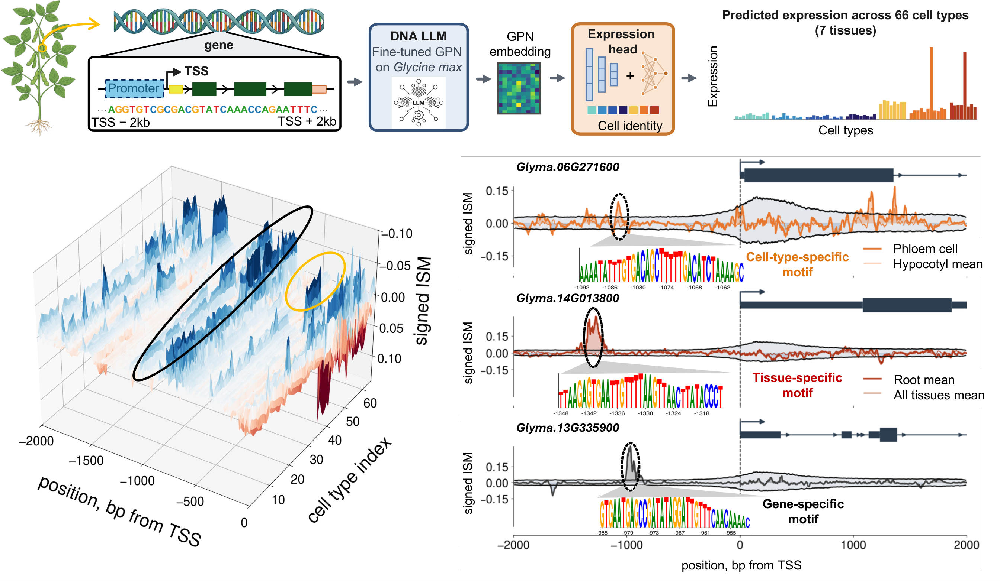

# CASCADE

Context-Aware Significance of Cross-gene Attribution for Discovering Elements
(CASCADE): a position-specific statistical framework for identifying
model-derived candidate regulatory elements from *in silico* saturation
mutagenesis of DNA sequence models.

*A gene's sequence around its transcription start site is embedded by a fine-tuned DNA
language model and decoded into predicted expression across many cell types (top).
Per-position attribution scores, compared against their cross-gene background at each
position, surface candidate regulatory motifs restricted to a single cell type, a single
tissue, or shared broadly across genes (bottom).*

## What's here

- **`training/`** -- a training pipeline for a cell-type-resolved
  sequence-to-expression model: a convolutional encoder and multi-task decoder
  that predicts expression across many cell types at once from a precomputed
  per-gene sequence embedding.
- **`cascade/`** -- the CASCADE seqlet-calling method itself: a drop-in,
  per-position-null replacement for TF-MoDISco's seqlet detector, plus an
  example driver script.

Each subdirectory has its own README with the full detail, requirements, and
usage examples.

## Model summary

For each gene, a frozen sequence-embedding backbone (not included here --
bring your own, e.g. a DNA language model) produces a per-base embedding matrix
`X_g in R^(L x D)` for a fixed window around the gene. A convolutional decoder
(two 1-D convolutions with batch normalization and ReLU, dropout, global max
pooling, layer normalization, a low-rank gene-latent bottleneck, and a
two-layer MLP head) maps `X_g` to one predicted expression value per cell
type, for all cell types simultaneously ("multi-task" training). See
`training/README.md` for the full architecture and training recipe.

## CASCADE summary

TF-MoDISco calls a seqlet by rolling a window over an attribution track and
comparing the window score to one pooled null fit across all positions.
CASCADE fits that same null **per position** instead, so a position with
uniformly high background attribution gets a stricter significance bar than a
position where sequences differ a lot from each other. Everything else
(seqlet extraction, non-maximum suppression, downstream clustering into
motifs) is unmodified MoDISco. See `cascade/README.md` for the full method and
an example driver.

## License

Released under the MIT License (see `LICENSE`).
